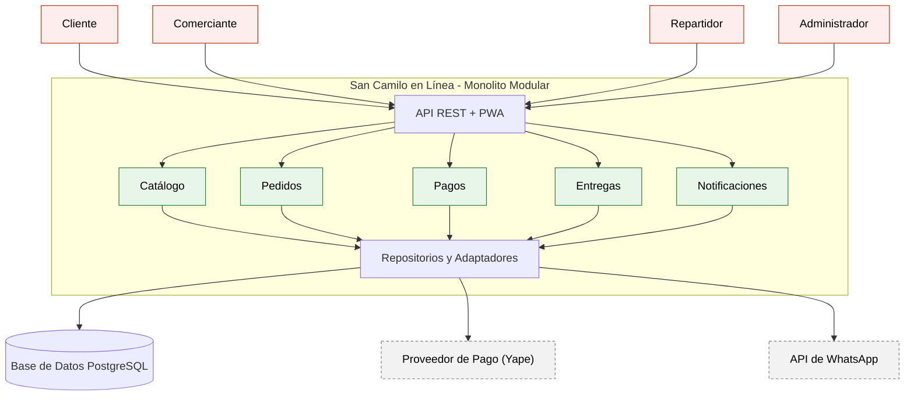

# San Camilo en Linea 

Construccion de Software - EPIS UNSA - 2026-B - Grupo 07

## Resumen ejecutivo

San Camilo en Linea es una propuesta de plataforma web progresiva para conectar a clientes con los puestos del Mercado San Camilo. El MVP permitira consultar productos por puesto, armar pedidos multi-puesto, elegir recojo o delivery, registrar pagos con Yape y enviar confirmaciones por WhatsApp. La solucion esta pensada para un equipo academico de hasta tres estudiantes, un plazo de un mes y un presupuesto reducido.

La prioridad de arquitectura es la capacidad de interaccion del comerciante: una persona con poca experiencia digital debe poder publicar un producto en 3 toques o menos desde un celular de gama baja. Las decisiones se documentan con drivers, escenarios medibles y ADR para que el equipo pueda justificar tanto lo elegido como lo descartado.

## Integrantes

| Nombre | Rol en el laboratorio |
|---|---|
| Kennedy | Integrante 1: requisitos, reglas, ADR y README |
| Diego | Integrante 2: alternativas, matriz y decision arquitectonica |
| Nagin | Integrante 3: diagramas y vista de despliegue |

## Caso

San Camilo en Linea permite consultar los catalogos de los puestos del Mercado San Camilo y realizar pedidos para recojo o delivery. El cliente puede comprar productos de varios puestos y pagar con Yape. Los comerciantes administran sus productos y reciben confirmaciones por WhatsApp; los repartidores actualizan el estado de sus entregas. El atributo critico es la capacidad de interaccion: un comerciante con poca experiencia debe publicar un producto en 3 toques o menos desde un celular de gama baja.

### Actores y flujo principal

1. El comerciante registra o actualiza productos, precios y disponibilidad desde la PWA.
2. El cliente consulta el catalogo agrupado por puesto y agrega productos al carrito.
3. El cliente confirma la modalidad de recojo o delivery, registra sus datos y adjunta la referencia del pago.
4. El sistema persiste el pedido, separa los items por puesto y notifica al comerciante.
5. Cada comerciante acepta o rechaza sus items; el repartidor consulta la asignacion y actualiza el estado de entrega.
6. El administrador puede revisar incidencias y mantener los puestos, usuarios y estados excepcionales.

### Alcance y supuestos

El alcance del MVP cubre catalogo, productos, pedidos, pagos referenciados, notificaciones y entregas basicas. Se asume que la integracion con Yape se realizara mediante un proveedor o mecanismo autorizado disponible para el proyecto, y que WhatsApp se conectara mediante un servicio habilitado. No se asume que Yape ofrece una API publica abierta ni se incluyen datos personales reales en prompts o repositorios.

## Arquitectura elegida

## Decisiones arquitectonicas

- [ADR-001: Estilo arquitectonico](docs/architecture/adr/001-estilo-arquitectonico.md)
- [ADR-002: Base de datos relacional](docs/architecture/adr/002-base-de-datos-relacional.md)
- [ADR-003: Autenticacion y roles](docs/architecture/adr/003-autenticacion-y-roles.md)

## Trazabilidad y entregables

- [E1: Drivers, requisitos y escenarios de calidad](docs/architecture/drivers.md)
- [E4: Directorio de decisiones arquitectonicas](docs/architecture/adr/)
- E3, E5 y E6: diagramas como codigo y despliegue seran integrados por el responsable de diagramacion.
- [E2: Matriz de decision](docs/architecture/matriz-decision.md)
- [E7: Bitácora de uso de IA](docs/architecture/bitacora-ia.md)

Los drivers `RF`, `QA` y `R` se citan dentro de los ADR. QA-01 verifica la publicacion de productos; QA-02 verifica la persistencia ante fallas de WhatsApp; QA-03 verifica el rendimiento; QA-04 verifica la incorporacion de un nuevo adaptador; y QA-05 verifica la autorizacion por rol y puesto.

## Criterios de calidad

| Atributo | Objetivo verificable |
|---|---|
| Capacidad de interaccion | Publicar un producto en 3 toques o menos y 15 segundos o menos en el 90 % de 20 pruebas. |
| Disponibilidad | Perder 0 pedidos en 100 pruebas cuando WhatsApp no responde y reintentar en 15 minutos o menos. |
| Rendimiento | Mantener p95 de catalogo <= 2 segundos y p95 de carrito <= 3 segundos con 200 clientes concurrentes. |
| Modificabilidad | Agregar un adaptador de pago en 2 dias-persona o menos sin cambiar otros modulos. |
| Seguridad | Rechazar el 100 % de 30 intentos de acceso a recursos de otro puesto. |

## Reflexion sobre el uso de la IA

La IA ayudo a proponer alternativas y a convertir las necesidades del mercado en requisitos y escenarios medibles. Tambien sirvio para revisar la estructura de los ADR y detectar consecuencias que podian quedar fuera. El equipo no tomo sus sugerencias como decisiones automaticas, porque una propuesta puede ignorar el presupuesto, el plazo o la conectividad real. Verificamos que Yape y WhatsApp requieren integraciones disponibles y no asumimos capacidades no confirmadas. La arquitectura elegida prioriza una solucion operable por un equipo pequeno y deja documentados sus riesgos. Las afirmaciones tecnicas deben contrastarse con documentacion oficial, pruebas y restricciones del caso. La bitacora registra las propuestas aceptadas, corregidas y rechazadas.

## Estado del trabajo

| Entregable | Responsable | Estado |
|---|---|---|
| E1: drivers y escenarios | Kennedy | Documentado |
| E2: alternativas y matriz | Diego | Culminado |
| E3: arquitectura Mermaid | Nagin | Culminado |
| E4: ADR 001, 002 y 003 | Kennedy | Documentado |
| E5: alternativa PlantUML | Nagin | Culminado |
| E6: despliegue | Nagin | Culminado |
| E7: bitacora de IA | Diego | Documentado |
| E8: README y revision cruzada | Equipo | consolidado |
