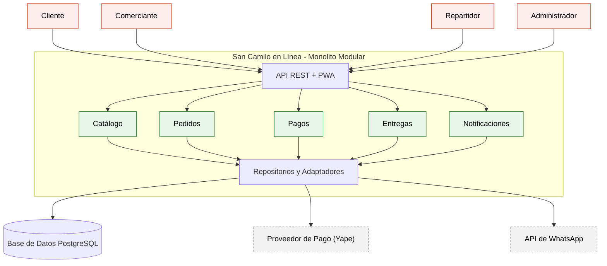
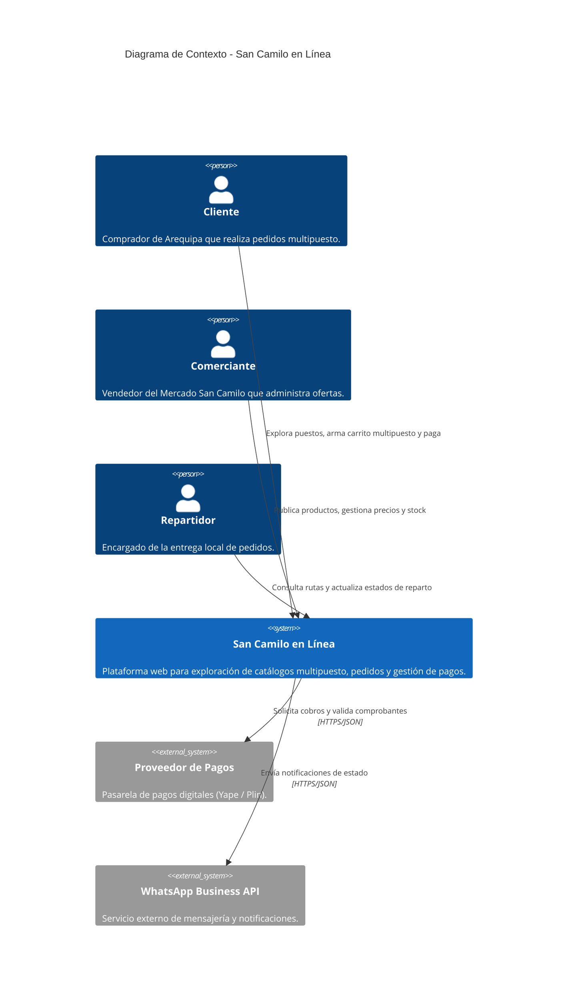
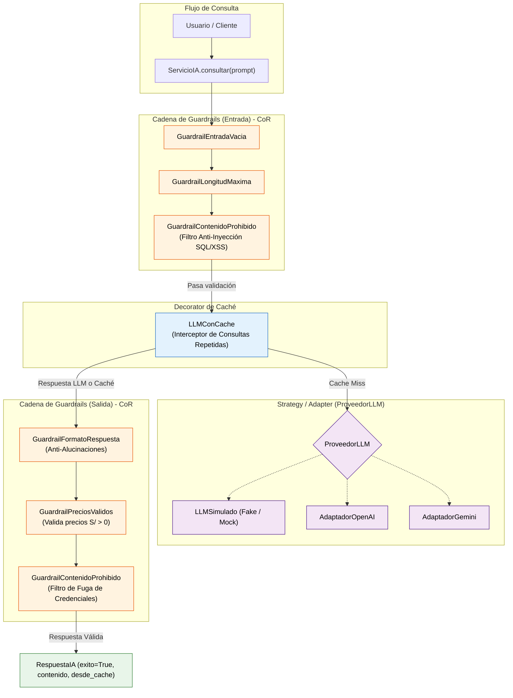

# San Camilo en Linea 

Construccion de Software - EPIS UNSA - 2026-B - Grupo 07

## Resumen 

San Camilo en Linea es una propuesta de plataforma web progresiva para conectar a clientes con los puestos del Mercado San Camilo. El MVP permitira consultar productos por puesto, armar pedidos multi-puesto, elegir recojo o delivery, registrar pagos con Yape y enviar confirmaciones por WhatsApp. La solucion esta pensada para un equipo academico de hasta tres estudiantes, un plazo de un mes y un presupuesto reducido.

La prioridad de arquitectura es la capacidad de interaccion del comerciante: una persona con poca experiencia digital debe poder publicar un producto en 3 toques o menos desde un celular de gama baja. Las decisiones se documentan con drivers, escenarios medibles y ADR para que el equipo pueda justificar tanto lo elegido como lo descartado.

## Integrantes

| Nombre | Correo institucional |
|---|---|
| Pari Charrez Dean Diego | dparich@unsa.edu.pe |
| Carfer Carpio Nagin Jazmin | ncarferc@unsa.edu.pe |
| Chirinos Rojas Kennedy | kchirinosr@unsa.edu.pe |

## Caso

San Camilo en Linea permite consultar los catalogos de los puestos del Mercado San Camilo y realizar pedidos para recojo o delivery. El cliente puede comprar productos de varios puestos y pagar con Yape. Los comerciantes administran sus productos y reciben confirmaciones por WhatsApp; los repartidores actualizan el estado de sus entregas. El atributo critico es la capacidad de interaccion: un comerciante con poca experiencia debe publicar un producto en 3 toques o menos desde un celular de gama baja.

### Actores y flujo principal

1. El comerciante registra o actualiza productos, precios y disponibilidad desde la PWA.
2. El cliente consulta el catalogo agrupado por puesto y agrega productos al carrito.
3. El cliente confirma la modalidad de recojo o delivery, registra sus datos y adjunta la referencia del pago.
4. El sistema persiste el pedido, separa los items por puesto y notifica al comerciante.
5. Cada comerciante acepta o rechaza sus items; el repartidor consulta la asignacion y actualiza el estado de entrega.
6. El administrador puede revisar incidencias y mantener los puestos, usuarios y estados excepcionales.

### Alcance y supuestos

El alcance del MVP cubre catalogo, productos, pedidos, pagos referenciados, notificaciones y entregas basicas. Se asume que la integracion con Yape se realizara mediante un proveedor o mecanismo autorizado disponible para el proyecto, y que WhatsApp se conectara mediante un servicio habilitado. No se asume que Yape ofrece una API publica abierta ni se incluyen datos personales reales en prompts o repositorios.

## Arquitectura elegida


```mermaid
flowchart TB
    CL["Cliente"]
    CO["Comerciante"]
    RE["Repartidor"]
    AD["Administrador"]

    subgraph APP["San Camilo en Línea - Monolito Modular"]
        API["API REST + PWA"]
        M1["Catálogo"]
        M2["Pedidos"]
        M3["Pagos"]
        M4["Entregas"]
        M5["Notificaciones"]
        INF["Repositorios y Adaptadores"]
    end

    DB[("Base de Datos PostgreSQL")]
    YP["Proveedor de Pago (Yape)"]
    WA["API de WhatsApp"]

    CL & CO & RE & AD --> API
    API --> M1 & M2 & M3 & M4 & M5
    M1 & M2 & M3 & M4 & M5 --> INF
    INF --> DB
    INF --> YP
    INF --> WA

    classDef mod fill:#E8F5E9,stroke:#2E7D32,color:#000
    classDef ext fill:#F2F2F2,stroke:#7F7F7F,color:#000,stroke-dasharray: 4 3
    classDef usr fill:#FDEDEC,stroke:#C8310E,color:#000
    class M1,M2,M3,M4,M5 mod
    class YP,WA ext
    class CL,CO,RE,AD usr
```

## Decisiones arquitectonicas

- [ADR-001: Estilo arquitectonico](docs/architecture/adr/001-estilo-arquitectonico.md)
- [ADR-002: Base de datos relacional](docs/architecture/adr/002-base-de-datos-relacional.md)
- [ADR-003: Autenticacion y roles](docs/architecture/adr/003-autenticacion-y-roles.md)
- [ADR-005: Capa de IA — Strategy, Decorator y Chain of Responsibility](docs/architecture/adr/005-capa-ia-guardrails.md)

## Trazabilidad y entregables

- [E1: Drivers, requisitos y escenarios de calidad](docs/architecture/drivers.md)
- [E2: Matriz de decisión](docs/architecture/matriz-decision.md)
- [E3: Código Mermaid de la arquitectura](docs/architecture/diagramas/arquitectura.mmd)
- [E4: Directorio de decisiones arquitectonicas](docs/architecture/adr/)
- [E5: Alternativa descartada en PlantUML](docs/architecture/diagramas/alternativa.puml)
- [E6: Vista de despliegue en PlantUML](docs/architecture/diagramas/despliegue.puml)
- [E7: Bitácora de uso de IA](docs/architecture/bitacora-ia.md)

E6 se documentó mediante PlantUML como alternativa de despliegue, debido a la incompatibilidad del entorno local con Graphviz y Python Diagrams. La decisión y el código fuente del diagrama quedan versionados en el repositorio.

Los drivers `RF`, `QA` y `R` se citan dentro de los ADR. QA-01 verifica la publicacion de productos; QA-02 verifica la persistencia ante fallas de WhatsApp; QA-03 verifica el rendimiento; QA-04 verifica la incorporacion de un nuevo adaptador; y QA-05 verifica la autorizacion por rol y puesto.

## Diagramas e imagenes generadas

| Entregable | Fuente | Imagen |
|---|---|---|
| Arquitectura elegida | [arquitectura.mmd](docs/architecture/diagramas/arquitectura.mmd) | [San Camilo API REST](docs/architecture/diagramas/img/San%20Camilo%20API%20REST-2026-10-04-030059.png) |
| Alternativa descartada | [alternativa.puml](docs/architecture/diagramas/alternativa.puml) | [Alternativa](docs/architecture/diagramas/img/Alternativa.png) |
| Vista de despliegue | [despliegue.puml](docs/architecture/diagramas/despliegue.puml) | [Despliegue](docs/architecture/diagramas/img/fig6.png) |
| Diagrama Mermaid embebido | [README.md](README.md#arquitectura-elegida) | Incluido en esta portada |

## Criterios de calidad

| Atributo | Objetivo verificable |
|---|---|
| Capacidad de interaccion | Publicar un producto en 3 toques o menos y 15 segundos o menos en el 90 % de 20 pruebas. |
| Disponibilidad | Perder 0 pedidos en 100 pruebas cuando WhatsApp no responde y reintentar en 15 minutos o menos. |
| Rendimiento | Mantener p95 de catalogo <= 2 segundos y p95 de carrito <= 3 segundos con 200 clientes concurrentes. |
| Modificabilidad | Agregar un adaptador de pago en 2 dias-persona o menos sin cambiar otros modulos. |
| Seguridad | Rechazar el 100 % de 30 intentos de acceso a recursos de otro puesto. |

## Reflexion sobre el uso de la IA

La IA ayudo a proponer alternativas y a convertir las necesidades del mercado en requisitos y escenarios medibles. Tambien sirvio para revisar la estructura de los ADR y detectar consecuencias que podian quedar fuera. El equipo no tomo sus sugerencias como decisiones automaticas, porque una propuesta puede ignorar el presupuesto, el plazo o la conectividad real. Verificamos que Yape y WhatsApp requieren integraciones disponibles y no asumimos capacidades no confirmadas. La arquitectura elegida prioriza una solucion operable por un equipo pequeno y deja documentados sus riesgos. Las afirmaciones tecnicas deben contrastarse con documentacion oficial, pruebas y restricciones del caso. La bitacora registra las propuestas aceptadas, corregidas y rechazadas.

## Diseno UML (Laboratorio 05)

### Entregables de diseno

| Entregable | Archivo(s) | Responsable | Imagen renderizada |
|---|---|---|---|
| E1 - Historia y Diagrama de Clases | [historia.md](docs/design/historia.md) / [clases.puml](docs/design/clases.puml) | Diego | [Diagrama de Clases](docs/design/img/diagrama%20de%20clases.png) |
| E2 - Diagrama de Secuencia | [secuencia-flujo.puml](docs/design/secuencia-flujo.puml) | Diego | [Diagrama de Secuencia](docs/design/img/secuencia.png) |
| E3 - Maquina de Estados | [estados-pedido.mmd](docs/design/estados-pedido.mmd) | Nagin | [Maquina de Estados](docs/design/img/Pago%20Global%20Flow%20for%20Pedido-2026-10-11-001531.png) |
| E4 - Diagrama de Actividades | [actividades-preparacion.puml](docs/design/actividades-preparacion.puml) | Nagin | [Diagrama de Actividades](docs/design/img/actividades-preparacion.png) |
| E5 - Diagrama de Paquetes | [paquetes.puml](docs/design/paquetes.puml) | Kennedy | [Diagrama de Paquetes](docs/design/img/paquetes.png) |
| E6 - Round-trip con IA | [src/pedidos/models.py](src/pedidos/models.py) / [classes_pedidos.puml](docs/design/classes_pedidos.puml) / [round-trip.md](docs/design/round-trip.md) | Kennedy | [Diagrama Invertido pyreverse](docs/design/img/classes_pedidos.png) |
| E7 - Consistencia y Bitacora | [consistencia.md](docs/design/consistencia.md) / [bitacora-ia.md](docs/design/bitacora-ia.md) | Equipo | - |
| E8 - Entrega | [README.md](README.md) / GitHub PR / tag `v0.5-diseno` | Equipo | - |

---

## Arquitectura C4 (Laboratorio 06)

### Diagrama de Contexto del Sistema (Mermaid C4)


```mermaid
C4Context
  title Diagrama de Contexto - San Camilo en Línea
  Person(cliente, "Cliente", "Comprador de Arequipa que realiza pedidos multipuesto.")
  Person(comerciante, "Comerciante", "Vendedor del Mercado San Camilo que administra ofertas.")
  Person(repartidor, "Repartidor", "Encargado de la entrega local de pedidos.")

  System(sancamilo, "San Camilo en Línea", "Plataforma web para exploración de catálogos multipuesto, pedidos y gestión de pagos.")

  System_Ext(pagos, "Proveedor de Pagos", "Pasarela de pagos digitales (Yape / Plin).")
  System_Ext(whatsapp, "WhatsApp Business API", "Servicio externo de mensajería y notificaciones.")

  Rel(cliente, sancamilo, "Explora puestos, arma carrito multipuesto y paga")
  Rel(comerciante, sancamilo, "Publica productos, gestiona precios y stock")
  Rel(repartidor, sancamilo, "Consulta rutas y actualiza estados de reparto")

  Rel(sancamilo, pagos, "Solicita cobros y valida comprobantes", "HTTPS/JSON")
  Rel(sancamilo, whatsapp, "Envía notificaciones de estado", "HTTPS/JSON")
```

### Entregables de Arquitectura C4

| Entregable | Archivo(s) | Responsable | Descripción |
|---|---|---|---|
| E1 - Inventario y Contexto | [inventario.md](docs/architecture/c4/inventario.md) | Diego | Inventario de actores, sistemas externos y contexto del sistema en C4 |
| E2 - Contenedores y Protocolos | [workspace.dsl](docs/architecture/c4/workspace.dsl) | Diego | Modelo de contenedores y protocolos de comunicación en Structurizr DSL |
| E3 - Componentes de la API | [workspace.dsl](docs/architecture/c4/workspace.dsl) / [paquetes.puml](docs/design/paquetes.puml) | Kennedy | Componentes del backend API y dependencias unidireccionales |
| E4 - Vista Dinámica | [workspace.dsl](docs/architecture/c4/workspace.dsl) | Kennedy | Flujo dinámico de confirmación de pedido y pago referenciado |
| E5 - Vista de Despliegue | [workspace.dsl](docs/architecture/c4/workspace.dsl) | Kennedy | Despliegue en infraestructura de Producción de bajo costo |
| E6 - Comparación de Vistas | [comparacion.md](docs/architecture/c4/comparacion.md) | Nagin | Comparación entre diagrama de secuencia UML y vista dinámica C4 |

---

## Patrones de Diseño y Capa de IA (Laboratorio 07)

### División de tareas para 3 integrantes

Para equilibrar la carga técnica, de pruebas y de documentación entre 3 personas, el equipo realizó el sorteo y distribución de responsabilidades y bloques de trabajo:

| Integrante | Rol Principal | Entregables a Cargo | Tareas Específicas |
|---|---|---|---|
| **Diego** (Integrante 1) | Línea Base, Variabilidad y Fábrica | E1, E2 y parte de E6 | • Implementar la versión ingenua (`src/<modulo>/antes/servicio.py`) y los mocks en `externos.py`.<br>• Diseñar y ejecutar las 8+ pruebas de caracterización iniciales.<br>• Identificar olores y redactar `olores.md`.<br>• Refactorizar hacia Strategy + Adapter + Factory (`pagos.py` o módulo equivalente).<br>• Medir la complejidad inicial y final con `radon` para `metricas.md`. |
| **Nagin** (Integrante 2) | Ciclo de Vida y Eventos del Dominio | E3, E4 y parte de E7 | • Implementar el patrón State traduciendo la máquina de estados del Lab 05 (`estados.py`).<br>• Implementar Observer y Decorator transversal (o patrón alternativo del caso).<br>• Crear las pruebas unitarias para transiciones inválidas y eventos de suscripción en `tests/test_patrones.py`.<br>• Elaborar los diagramas PlantUML de State, Observer y la interacción del servicio en `docs/design/patrones/`. |
| **Kennedy** (Integrante 3) | Capa de IA, Guardrails y Cierre Arquitectónico | E5, E7 (IA) y E8 | • Diseñar la arquitectura del componente de IA en `ia.py` (Strategy/Adapter, Decorator de caché y Chain of Responsibility para guardrails).<br>• Implementar el LLM simulado y las pruebas de validación de salida / guardrails.<br>• Elaborar el diagrama PlantUML de la arquitectura de IA y actualización de `clases.puml` con el soporte de `pyreverse`.<br>• Documentar `bitacora-ia.md`, redactar el `ADR-005` y actualizar el `README.md`. |

### Entregables del Bloque de IA y Cierre (Integrante 3: Kennedy)

| Entregable | Archivo(s) | Responsable | Descripción |
|---|---|---|---|
| **E5 - Arquitectura IA** | [src/pedidos/ia.py](src/pedidos/ia.py) | Kennedy | Componente con Strategy/Adapter (`ProveedorLLM`), Decorator (`LLMConCache`) y Chain of Responsibility (`Guardrail`) |
| **E5 - LLM Simulado y Pruebas** | [tests/test_ia.py](tests/test_ia.py) / [tests/conftest.py](tests/conftest.py) | Kennedy | 38 pruebas unitarias automatizadas con pytest (100% aprobadas) para guardrails, caché e integración |
| **E7 - Diagrama de Clases IA** | [ia-patrones.puml](docs/design/patrones/ia-patrones.puml) / [classes_pedidos_ia.puml](docs/design/patrones/classes_pedidos_ia.puml) / [clases.puml](docs/design/clases.puml) | Kennedy | Modelado conceptual PlantUML, ingeniería inversa con pyreverse y actualización del modelo general |
| **E8 - ADR-005** | [005-capa-ia-guardrails.md](docs/architecture/adr/005-capa-ia-guardrails.md) | Kennedy | Justificación de Strategy/Adapter, Decorator de caché y Chain of Responsibility para guardrails |
| **E8 - Bitácora de IA** | [bitacora-ia.md](docs/design/patrones/bitacora-ia.md) | Kennedy | Registro de prompts, propuestas aceptadas y rechazadas durante el Lab 07 |
| **E8 - Cierre Arquitectónico** | [README.md](README.md) | Kennedy | Documentación y consolidación de la arquitectura de patrones del Laboratorio 07 |

### Arquitectura de Patrones en la Capa de IA

La capa de inteligencia artificial para el módulo `pedidos` fue diseñada e implementada bajo tres patrones de diseño complementarios ([ADR-005](docs/architecture/adr/005-capa-ia-guardrails.md)):


```mermaid
flowchart TD
    subgraph CLIENTE["Flujo de Consulta"]
        U["Usuario / Cliente"] --> SI["ServicioIA.consultar(prompt)"]
    end

    subgraph ENTRADA["Cadena de Guardrails (Entrada) - CoR"]
        SI --> G1["GuardrailEntradaVacia"]
        G1 --> G2["GuardrailLongitudMaxima"]
        G2 --> G3["GuardrailContenidoProhibido\n(Filtro Anti-Inyección SQL/XSS)"]
    end

    subgraph CACHE["Decorator de Caché"]
        G3 -->|Pasa validación| DC["LLMConCache\n(Interceptor de Consultas Repetidas)"]
    end

    subgraph STRATEGY["Strategy / Adapter (ProveedorLLM)"]
        DC -->|Cache Miss| ST{"ProveedorLLM"}
        ST -.-> MOCK["LLMSimulado (Fake / Mock)"]
        ST -.-> OAI["AdaptadorOpenAI"]
        ST -.-> GEM["AdaptadorGemini"]
    end

    subgraph SALIDA["Cadena de Guardrails (Salida) - CoR"]
        DC -->|Respuesta LLM o Caché| GS1["GuardrailFormatoRespuesta\n(Anti-Alucinaciones)"]
        GS1 --> GS2["GuardrailPreciosValidos\n(Valida precios S/ > 0)"]
        GS2 --> GS3["GuardrailContenidoProhibido\n(Filtro de Fuga de Credenciales)"]
    end

    GS3 -->|Respuesta Válida| RES["RespuestaIA (exito=True, contenido, desde_cache)"]

    classDef ok fill:#E8F5E9,stroke:#2E7D32,color:#000
    classDef cor fill:#FFF3E0,stroke:#E65100,color:#000
    classDef dec fill:#E3F2FD,stroke:#1565C0,color:#000
    classDef st fill:#F3E5F5,stroke:#4A148C,color:#000
    class G1,G2,G3,GS1,GS2,GS3 cor
    class DC dec
    class ST,MOCK,OAI,GEM st
    class RES ok
```

1. **Strategy / Adapter (`ProveedorLLM`):** Desacopla la lógica de negocio de los proveedores concretos de modelos de lenguaje (`LLMSimulado`, `AdaptadorOpenAI`, `AdaptadorGemini`), permitiendo intercambiar el motor en tiempo de ejecución o en pruebas sin alterar el orquestador `ServicioIA`.
2. **Decorator (`LLMConCache`):** Intercepta llamadas idénticas al LLM almacenando en memoria las respuestas normalizadas. Garantiza que ante consultas repetidas el modelo no se vuelva a invocar, optimizando latencia y costos de API de forma transparente.
3. **Chain of Responsibility (`Guardrail`):** Permite encadenar reglas de validación independientes y desacopladas:
   - **Entrada:** Rechaza consultas vacías, que excedan la longitud máxima o contengan intentos de inyección (`DROP TABLE`, `<script>`).
   - **Salida:** Bloquea alucinaciones conocidas, detecta precios erróneos (precios $\le 0$ en soles `S/`) y previene la fuga de claves o credenciales del sistema.

### Instrucciones de Ejecución de Pruebas y Validación

El proyecto incluye configuración nativa con `pyproject.toml` para ejecutar la suite completa de pruebas:

```bash
# 1. Ejecutar las 38 pruebas unitarias del componente de IA con reporte detallado
python -m pytest tests/test_ia.py -v

# 2. Ejecutar todas las pruebas del repositorio con salida abreviada
python -m pytest tests/ -v --tb=short
```

### Comandos para Regenerar Diagramas con pyreverse

Para reproducir la ingeniería inversa sobre el componente de IA y generar el archivo PlantUML:

```bash
# Ejecutar pyreverse indicando la raíz de fuentes
python -m pylint.pyreverse.main --source-roots src -o puml -p pedidos_ia src/pedidos/ia.py
```

---

## Estado del trabajo

| Entregable | Responsable | Estado |
|---|---|---|
| **Laboratorio 04 — Arquitectura y Drivers** | | |
| E1: drivers y escenarios | Kennedy | Completado |
| E2: alternativas y matriz | Diego | Completado |
| E3: arquitectura Mermaid | Nagin | Completado |
| E4: ADR 001, 002 y 003 | Kennedy | Completado |
| E5: alternativa PlantUML | Nagin | Completado |
| E6: despliegue | Nagin | Completado |
| E7: bitacora de IA | Diego | Completado |
| E8: README y revision cruzada | Equipo | Completado |
| **Laboratorio 05 — Diseño UML** | | |
| E1: Historia de usuario y diagrama de clases | Diego | Completado |
| E2: Diagrama de secuencia | Diego | Completado |
| E3: Maquina de estados (Mermaid) | Nagin | Completado |
| E4: Diagrama de actividades | Nagin | Completado |
| E5: Diagrama de paquetes | Kennedy | Completado |
| E6: Round-trip con IA (codigo y diferencias) | Kennedy | Completado |
| E7: Consistencia y bitacora de IA | Equipo | Completado |
| E8: Revision cruzada, README y tag final | Equipo | Completado |
| **Laboratorio 06 — Modelo C4** | | |
| E1: Inventario y contexto en Structurizr DSL | Diego | Completado |
| E2: Contenedores y protocolos en workspace.dsl | Diego | Completado |
| E3: Componentes de la API (paquetes.puml) | Kennedy | Completado |
| E4: Vista dinamica de confirmacion y pago | Kennedy | Completado |
| E5: Despliegue en entorno Produccion | Kennedy | Completado |
| E6: Exportacion CLI, imagenes y comparacion | Nagin | Completado |
| E7: Revision C4, explicacion y bitacora de IA | Nagin | Completado |
| E8: Revision cruzada, README y tag final | Nagin | Completado |
| **Laboratorio 07 — Patrones de Diseño** | | |
| E1: Versión ingenua (`antes/servicio.py`), mocks (`externos.py`) y pruebas | Diego | En proceso |
| E2: Análisis de olores (`olores.md`) y métricas de complejidad con radon (`metricas.md`) | Diego | En proceso |
| E3: Patrón State para ciclo de vida de pedidos (`estados.py`) | Nagin | En proceso |
| E4: Patrón Observer y Decorator transversal | Nagin | En proceso |
| E5: Capa de IA con Strategy, Decorator y Chain of Responsibility (`ia.py`) | Kennedy | Completado |
| E6: Refactorización hacia Strategy + Adapter + Factory (`pagos.py`) | Diego | En proceso |
| E7: Diagramas PlantUML (State, Observer) y pruebas (`test_patrones.py`) | Nagin | En proceso |
| E7-IA: Diagrama PlantUML y pyreverse de la Capa de IA (`ia-patrones.puml`) | Kennedy | Completado |
| E8: ADR-005, bitácora de IA y cierre arquitectónico en README | Kennedy | Completado |
